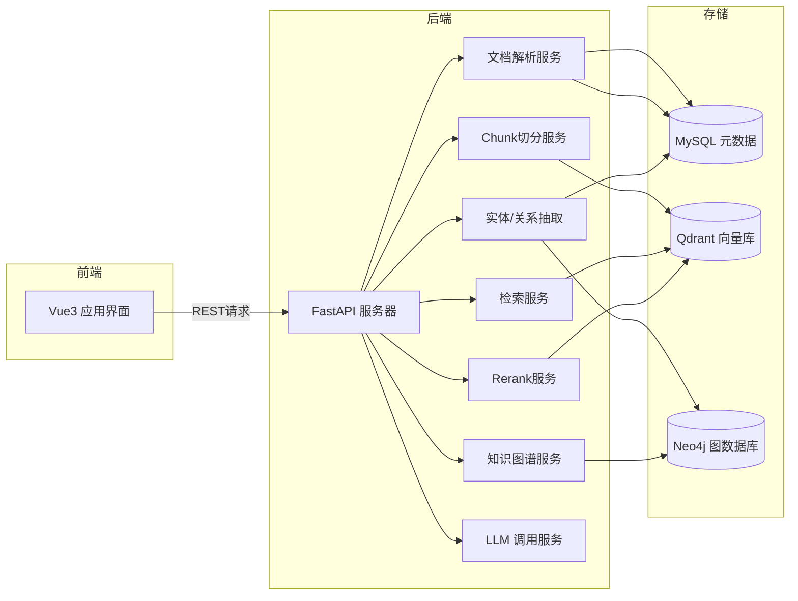
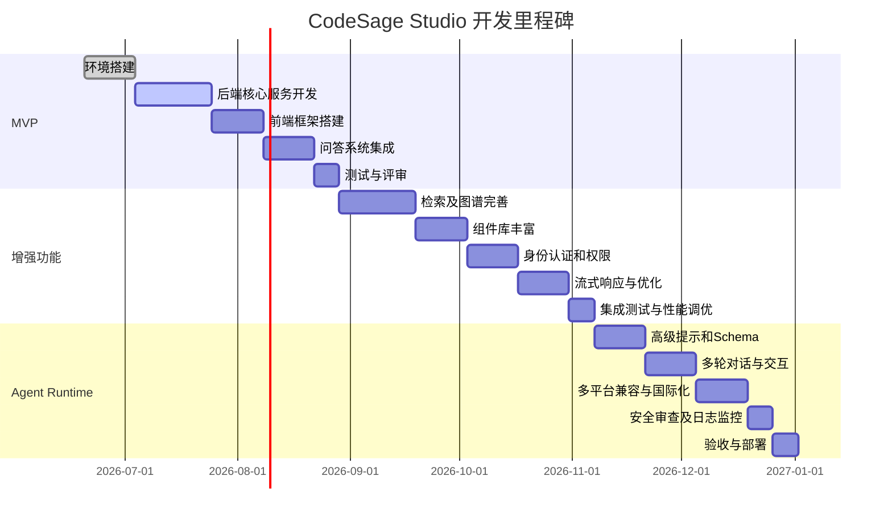

# 执行摘要

本项目旨在基于现有仓库（CodeSage）及FastAPI框架，打造一个**智能化代码知识库与交互式UI生成平台**——“CodeSage Studio”。其核心目标是让大语言模型（LLM）不再输出静态Markdown或HTML文本，而是输出结构化的**UI Schema（JSON）**，由前端根据预定义组件库动态渲染出安全、交互式的界面。相比传统的RAG问答系统，本项目的价值在于为用户提供更加直观、可操作的结果呈现方式，从而提升用户体验和产品竞争力。典型用户包括研发人员、分析师和技术面试者等，他们可以借此平台进行代码库分析、数据可视化、项目架构探查、AI Agent交互等工作。成功指标（KPI）可包括：用户查询的满意度、任务完成率、平台日活跃度等（KPI尚未明确）。通过分阶段的开发计划和全面的功能设计，项目计划构建一个模块化、高可用、易扩展的系统架构，实现高效的向量检索、知识图谱构建和LLM接口，同时保证前端渲染安全（避免XSS/注入）和系统可维护性。 

**关键决策点及待定事项：**项目使用的LLM服务提供商（OpenAI GPT/华为盘古等）、知识图谱存储选型（Neo4j vs KuzuDB 等）、具体KPI、用户权限模型（RBAC/ABAC 细则）等尚待进一步确认。

## 项目概述

- **目标与定位：**构建一个面向开发者和数据分析者的AI原生交互平台，能够智能地解析代码和文档、生成UI Schema并渲染动态界面。区别于传统只输出文本答案的RAG系统，本项目主张由LLM生成**可渲染的结构化界面描述**，实现“生成式UI”（GenUI）的愿景。
- **主要价值主张：**为用户提供更丰富、更直观、更可交互的AI结果展示。例如，以图表、流程图、可点击组件等形式呈现信息，而非单纯文本；支持用户在结果界面直接进行二次交互（过滤、点击深挖等）；加速开发流程（AI 自动生成界面原型），节省前端硬编码成本。
- **目标用户群：**程序员、数据分析师、产品经理、技术面试官等，需要对海量代码和文档进行分析或可视化演示的群体；也包括研发团队进行知识管理和代码审查时需要更友好交互体验的用户。
- **成功指标（KPI）：**典型KPIs 可包括：**用户满意度**（Survey分数）、**任务完成率**（查询成功并产生正确图表/结构的比例）、**系统响应时延**（如P95响应时间<1s）、**系统吞吐量**（QPS）和**活跃用户数**等。*（具体KPI指标需与产品经理进一步确认。）*

**关键决策点与待定事项：**依赖组件及技术栈如选择哪种LLM模型（GPT-4.5、华为盘古、清华CPM等）、知识图谱引擎选型（Neo4j vs KuzuDB；考虑性能和维护性）、KPI细化、用户分级与权限策略尚未明确。

## 用户场景与用例

### 场景1：代码登录流程分析

- **触发条件：**用户上传或选定一个后端项目，发起查询“分析用户登录流程”。
- **用户期望：**系统解析项目代码，抽取登录相关模块（如Controller、Service、Authentication），生成登录流程图并提供关键代码片段链接。
- **交互流程：**用户发起查询后，后端检索相关代码块、构建调用图；LLM生成一个包含流程图组件和代码片段组件的JSON；前端渲染出节点连线图和可点击的代码查看器；用户可点击节点查看源码。
- **示例输入/输出：**  

  - *示例输入（用户提问）：*  
    ```text
    分析这个SpringBoot项目的登录流程。
    ```  
  - *示例输出（UI Schema JSON，示意）：*  
    ```json
    {
      "layout": "dashboard",
      "components": [
        {
          "type": "flowchart",
          "props": {
            "title": "登录流程图",
            "nodes": [
              {"id": "SysLoginController", "label": "SysLoginController"},
              {"id": "LoginService", "label": "LoginService"},
              {"id": "AuthManager", "label": "AuthenticationManager"},
              {"id": "JwtService", "label": "JwtTokenService"}
            ],
            "edges": [
              {"from": "SysLoginController", "to": "LoginService", "label": "调用"},
              {"from": "LoginService", "to": "AuthManager", "label": "授权"},
              {"from": "AuthManager", "to": "JwtService", "label": "签发令牌"}
            ]
          }
        },
        {
          "type": "code_viewer",
          "props": {
            "title": "LoginService.java",
            "language": "java",
            "code": "// 用户登录处理\\npublic JwtToken login(...) { ... }"
          }
        }
      ]
    }
    ```  
    前端根据Schema渲染流程图组件和代码查看器组件。

### 场景2：消费数据可视化

- **触发条件：**用户上传或导入个人消费明细数据，发起查询“展示消费数据分析”。
- **用户期望：**系统对消费数据进行统计，生成不同类型的数据可视化组件（饼图、柱状图、筛选器和表格）以直观展示消费结构。
- **交互流程：**后端拆分数据、生成统计结果；LLM生成包含图表和筛选器组件的UI Schema；前端渲染出仪表盘，用户可通过筛选组件动态调整图表。
- **示例输入/输出：**  

  - *示例输入：*  
    ```text
    请分析我的2026年1月到5月的消费数据。
    ```  
  - *示例输出（JSON Schema示例）：*  
    ```json
    {
      "layout": "dashboard",
      "components": [
        {
          "type": "pie_chart",
          "props": {
            "title": "消费分类占比",
            "data": [
              {"label": "餐饮", "value": 30},
              {"label": "购物", "value": 25},
              {"label": "娱乐", "value": 20},
              {"label": "交通", "value": 15},
              {"label": "其他", "value": 10}
            ]
          }
        },
        {
          "type": "bar_chart",
          "props": {
            "title": "月度消费柱状图",
            "xAxis": ["1月", "2月", "3月", "4月", "5月"],
            "series": [
              {"name": "餐饮", "data": [5, 6, 5, 7, 7]},
              {"name": "购物", "data": [4, 5, 6, 5, 5]},
              {"name": "娱乐", "data": [3, 2, 4, 4, 5]}
            ]
          }
        },
        {
          "type": "data_table",
          "props": {
            "title": "消费明细",
            "columns": ["日期", "类型", "金额"],
            "rows": [
              ["2026-01-05", "餐饮", 80],
              ["2026-01-20", "购物", 120],
              ["2026-02-15", "交通", 50]
            ]
          }
        }
      ]
    }
    ```  
    最终呈现：左侧饼图，右上柱状图，下方可筛选的消费明细表格。

### 场景3：项目架构图生成

- **触发条件：**用户提供项目说明或上传代码仓库，查询“生成该项目架构图”。
- **用户期望：**系统分析代码/文档结构，生成模块或包层次的关系图示，并列出主要组件（如Controller、Service、Database）。
- **交互流程：**后端抽取代码包、模块关系；LLM生成结构化组件布局；前端渲染为层次图或树形图，用户可以展开查看详情。  
- **示例输入/输出：**  

  - *输入：*  
    ```text
    根据以下代码结构生成微服务系统架构图：AuthService、UserService、OrderService三部分相互调用。
    ```  
  - *输出示例：*  
    ```json
    {
      "layout": "dashboard",
      "components": [
        {
          "type": "tree_view",
          "props": {
            "title": "微服务架构",
            "nodes": [
              {"id": "API", "label": "API 网关"},
              {"id": "Auth", "label": "认证服务"},
              {"id": "User", "label": "用户服务"},
              {"id": "Order", "label": "订单服务"},
              {"id": "DB", "label": "数据库"}
            ],
            "edges": [
              {"from": "API", "to": "Auth", "label": "转发请求"},
              {"from": "API", "to": "User", "label": "转发请求"},
              {"from": "API", "to": "Order", "label": "转发请求"},
              {"from": "Auth", "to": "DB", "label": "读取用户信息"},
              {"from": "User", "to": "DB", "label": "读取/写入用户数据"},
              {"from": "Order", "to": "DB", "label": "读取/写入订单"}
            ]
          }
        }
      ]
    }
    ```  
    渲染结果：树形服务架构图（比如使用D3.js绘制关系图）。

### 场景4：AI Agent交互与分析

- **触发条件：**用户基于已有UI成果进一步点击或给出新指令，例如点击架构图中的“AuthService”，或查询“详细分析X流程”。
- **用户期望：**系统继续进行后续检索/分析，将界面更新或弹出新视图。例如用户点击“AuthService”，触发后端再检索相关服务的实现详情，生成新的JSON界面。
- **交互流程：**前端捕获用户点击事件，将细化任务发送到后端；后端做二次检索、LLM生成新Schema；前端局部更新页面或打开新弹窗显示新结果。
- **示例输入/输出：**  
  - *输入（用户操作）：* 点击“AuthService”节点，触发查询“AuthService详细功能”。  
  - *输出示例（JSON Schema）：*  
    ```json
    {
      "layout": "modal",
      "components": [
        {
          "type": "markdown_card",
          "props": {
            "title": "AuthService 功能说明",
            "content": "AuthService负责用户登录认证、生成JWT令牌和验证权限..."
          }
        },
        {
          "type": "code_viewer",
          "props": {
            "title": "AuthService.java 片段",
            "language": "java",
            "code": "public void authenticate(User user) { ... }"
          }
        }
      ]
    }
    ```  
    前端弹出模态框，其中包含Markdown说明和代码查看器。

### 场景5：代码搜索与定位

- **触发条件：**用户在代码知识库中搜索特定函数或类的用途，如“哪里调用了UserService.updatePassword？”。
- **用户期望：**系统检索相关代码引用，返回可交互列表或代码片段。UI Schema可能为列表或表格，每行可点击跳转到源码。
- **交互流程：**后端向量+文本混合检索相关文件和位置；LLM或逻辑生成包含代码引用列表组件；前端渲染列表，用户可点击查看上下文。

### 场景6：文档摘要与解释

- **触发条件：**用户上传某段技术文档或API手册，询问“请概括这段文档”。
- **用户期望：**系统生成结构化摘要，可能以列表或卡片形式呈现关键点，而非仅文字段落。
- **交互流程：**后端使用LLM生成提纲式内容；UI Schema使用文本卡片或可折叠列表；用户可展开查看详情。
- **示例输出（简化）：**  
  ```json
  {
    "layout": "dashboard",
    "components": [
      {
        "type": "bullet_list",
        "props": {
          "title": "主要功能点",
          "items": ["支持用户注册/登录", "使用JWT进行认证", "提供角色权限控制"]
        }
      },
      {
        "type": "table",
        "props": {
          "title": "API 接口摘要",
          "columns": ["接口", "描述"],
          "rows": [
            ["/login", "用户登录，返回Token"],
            ["/logout", "用户登出"]
          ]
        }
      }
    ]
  }
  ```

### 场景7：实时数据监控面板

- **触发条件：**用户查询“显示当前服务器指标”或“最近24小时请求统计”。
- **用户期望：**系统提供实时或最近数据的仪表板，展示如折线图、环比表或警报卡片等可交互组件。
- **交互流程：**后端从时序数据库或监控系统获取数据；LLM输出相应图表配置；前端渲染实时图表，并支持筛选时间范围。

### 场景8：多轮问答与助手任务

- **触发条件：**用户对复杂问题进行多轮交互，例如“制定项目上线计划”，并在回答基础上连续询问“步骤2需要哪些资源？”。
- **用户期望：**系统提供多步骤计划列表或甘特图；进一步询问时针对特定步骤给出新的可视化信息（例如资源列表表格或时间线图）。
- **交互流程：**系统初次给出结构化计划后，用户点击或查询时触发新检索。通过状态管理保存上下文，更新或添加UI组件以展示细节。

**关键决策点与待定事项：**组件库支持哪些可交互元素（如折线图、甘特图等）尚未最终敲定；是否支持实时数据刷新；多轮对话的状态管理方式（客户端缓存 vs 后端会话存储）需设计。

## 功能需求

将功能按优先级划分如下：

- **MVP（必须）：**  
  - **API端点：**  
    - `POST /api/upload`：上传文档/代码（文件或URL），请求体为`multipart/form-data`或JSON，返回`{"doc_id": "...", "status": "processing"}`。  
    - `POST /api/query`：提交用户问题或指令，输入`{"query": "...", "doc_ids": [...], "session_id": ...}`，返回UI Schema JSON（结构见前文示例）。  
    - `GET /api/query/{session_id}/stream`：可选，使用SSE/WebSocket以流式方式返回生成的UI Schema分片。  
    - `GET /api/health`：健康检查，返回状态OK。  
  - **前端组件：**实现Vue3应用，包含：查询输入框、文件上传组件、结果渲染区。结果渲染区根据返回的JSON构建组件树（详见后文组件库表）。  
  - **后端服务：**  
    - 文档解析服务：处理上传的文档/代码，提取文本或结构化内容；  
    - Chunk分片服务：将文本分割为适合检索的小块；  
    - 向量索引服务：使用Qdrant存储嵌入；  
    - 实体/关系抽取服务：调用LLM或NLP模型标注实体和关系，用于知识图谱；  
    - 知识图谱服务：构建/更新Neo4j图谱；  
    - 检索服务：基于用户query同时执行向量检索（Qdrant）和图检索（Neo4j）；  
    - 排序服务：对检索结果进行Rerank（可调用Cross-Encoder）；  
    - LLM服务：调用大语言模型生成答案UI Schema（可以使用OpenAI、华为等API）；  
    - 安全/权限服务：认证、鉴权（如JWT+角色）；  
    - 日志/审计服务：记录查询和生成的输出用于追溯。  
  - **向量库：**选择**Qdrant**作为向量数据库。原因包括：开源免许可（Oracle文档推荐开源向量库）、支持大规模数据、高性能相似度搜索，并且支持基于元数据（payload）过滤查询。示例：向Qdrant插入分片向量，带JSON `payload` 描述来源，检索时可按标签过滤。  
  - **图谱存储：**选择**Neo4j**（社区版），兼顾成熟度和ACID事务支持。Neo4j支持Cypher查询和企业级特性，可方便构建关系图谱。另可评估**KuzuDB**（内嵌高性能图引擎），但需注意其2025年被Apple收购后已归档，意味着无活跃开发。**权衡：**Neo4j功能全面但部署成本稍高；KuzuDB单机极快但不支持多用户架构。  
  - **LLM接入：**系统应支持至少一个通用大模型（如GPT-4.5或华为盘古），在Agent运行时可灵活替换。可利用OpenAI“函数调用”方式强制输出JSON Schema（严格JSON）。前端通过FastAPI调用LLM服务接口，并根据输出的JSON动态渲染。  
  - **权限与审计：**实现基于JWT的用户身份认证，使用FastAPI自带OAuth2/Bearer工具进行保护。设计角色（Admin/User）可进行RBAC，记录用户的查询操作和界面生成日志，用于后续分析。  
  - **实时/流式响应：**为了提升用户体验，`/api/query` 支持返回[Server-Sent Events (SSE)](https://fastapi.tiangolo.com/zh/advanced/streaming-response/)或WebSocket推送，逐步送达UI Schema的各个部分。前端可边解析边渲染，减少等待感。  
  - **并发与性能目标：**目标支持至少**百级QPS**和低延迟响应（具体值待定）。MVP重点验证架构可扩展性，后续可增加负载均衡和缓存。

- **次要（可选）：**  
  - **高级检索：**加入BM25文本检索引擎，与向量搜索混合（Hybrid Search）。  
  - **多模态支持：**支持图像、PDF等文档的解析。  
  - **多语言支持：**前端国际化、多语言LLM输出（未指定语言需求，可视为未来扩展）。  
  - **UI组件市场：**允许动态扩充组件库（用户或开发者可定义新的组件类型）。  
  - **可视化编辑器：**前端集成可视化编辑器，让用户可微调生成的UI（例如移动组件位置、调整样式）。  
  - **多租户与项目隔离：**支持多个知识库实例隔离。  
  - **合规审查：**根据需求集成数据隐私扫描。  

- **未来扩展：**  
  - **Agent运行时：**集成更复杂的智能Agent能力，实现多Agent协作与自启动任务（可用LangChain之类框架）。  
  - **自我学习：**利用用户反馈（点击、好评）优化检索和生成模型。  
  - **移动端支持：**开发移动端响应式界面或小程序。  
  - **企业版功能：**如单点登录(SSO)、审计追踪(ACRA)、监控告警。  

**功能接口示例（简要）**：

- **文档导入API** `/api/upload`：  
  - *请求示例*：`POST /api/upload`，FormData参数`file=@XXX.pdf`或`URL: "https://..."`。  
  - *返回示例*：`{"doc_id": "abc123", "status": "processing"}`。  

- **检索问答API** `/api/query`：  
  - *请求示例*：`POST /api/query`，JSON体`{"query": "分析X流程", "doc_ids": ["abc123"], "session_id": "sid456"}`。  
  - *返回示例*：HTTP 200，返回UI Schema JSON，如上场景1示例。  

- **流式返回** `/api/query/stream`：  
  - *请求*：`GET /api/query/sid456/stream`。  
  - *功能*：使用SSE逐行返回JSON片段，前端可边接边渲染。  

- **组件事件**：前端**组件库**中，每个组件（饼图、柱状图、表格、流程图等）均可定义事件回调，如`onClick`、`onFilterChange`等。示例：饼图组件`PieChart` props包括`data`数组，事件`segmentClick`。前端实现时，通过Vue的组件映射表将JSON`type`映射到具体组件，并传递`props`和事件处理函数。  

**关键决策点与待定事项：**检索链路设计（是否加入BM25；混合权重如何确定）；实时流式实现方式（SSE vs WebSocket）；组件库丰富度（需评估是否增加地图、力导向图等高级组件）；并发性能指标需要通过压力测试确认；日志与监控方案（使用何种监控工具）未定。

## 非功能需求

- **安全性：**严格校验与隔离。一切来自LLM的输出都必须通过**JSON Schema验证**后再发送给前端。禁止前端直接使用`v-html`渲染LLM输出的原始HTML/Markdown，以避免XSS注入风险。前端仅允许渲染经过预定义组件映射的内容，并对文本内容使用自动转义（Vue默认行为）；如果需要渲染富文本（Markdown），必须先通过安全库（如DOMPurify）进行清洗。后端应实施输入白名单和输出白名单策略：例如只接受特定结构的JSON键值；对输入的API参数进行严格类型和长度校验，避免SQL注入或命令注入。部署环境启用HTTPS，使用FastAPI推荐的安全工具（OAuth2、JWT）实现鉴权。  
- **可用性：**界面友好，操作简洁。提供清晰的错误提示（如LLM输出不符合Schema时，返回友好错误JSON让前端提示“生成失败，请稍后重试”）。界面布局响应式设计，支持常用分辨率。  
- **可扩展性：**架构应采用微服务设计，各模块（爬取/解析、检索、LLM、前端）可以独立扩容。后端使用异步和消息队列（如Celery）处理耗时任务，前端可平行加载组件。需要考虑未来并行部署多实例的场景，例如使用Kubernetes部署FastAPI服务和Qdrant/Neo4j集群。  
- **可维护性：**后端代码遵循分层架构（API层、业务层、数据层）。充分使用模块化和配置化，以便新增功能和替换组件（如模型替换）时影响最小。提供详细文档和自动化部署脚本（Docker Compose/K8s Helm）。  
- **国际化：**系统基础框架支持多语言（国际化i18n），目前主要界面语言为中文，后续可添加英文等。  
- **合规性：**（视项目具体情况而定）如需处理用户个人数据，应遵守相关隐私法规。未明确规定，此处标记为“待评估”。  

**关键决策点与待定事项：**国际化需求是否必要（当前暂无明确要求）；若针对企业客户，是否需要合规认证（如GDPR、ISO27001）；前端框架选型（仅Vue3还是加入TypeScript等安全增强技术）。

## 架构设计

系统采用前后端分离、微服务架构：  



- **模块划分：**前端Vue3应用负责用户界面和渲染，根据LLM输出的JSON动态生成组件。后端FastAPI提供RESTful API，内部划分为多个协同微服务：文档解析、Chunk切分、实体抽取、知识图谱构建、检索（向量+图）、重新排序、LLM接口等。数据存储层使用MySQL保存文档元信息和用户数据，Qdrant保存嵌入向量，Neo4j保存知识图谱结构。  
- **数据流：**用户操作→前端生成API请求→FastAPI接收后向对应服务转发。解析服务将文档内容保存至MySQL，并触发Chunk与实体抽取；Chunk服务对文本生成向量并入Qdrant；实体抽取输出关系入Neo4j。用户查询时，检索服务并行调用向量搜索（Qdrant）和图搜索（Neo4j），合并结果给Rerank，然后由LLM整合成最终答案的JSON。最终JSON返回给前端，前端映射成组件并显示给用户。数据流中所有跨进程通信可通过内部消息队列（如RabbitMQ、Kafka）或FastAPI的异步任务完成。  
- **组件接口规范：**各服务之间的通信使用内部REST或RPC。示例：Chunk服务REST接口 `/api/chunk/process` 接收文档ID，返回分片列表；GraphBuilder `/api/graph/update` 接收实体关系数据更新图谱。前端-后端接口按上文说明设计。所有API支持JSON格式，且请求模型由Pydantic定义，FastAPI自动生成OpenAPI文档。  
- **消息/事件机制：**可使用Celery异步任务队列处理长时任务（如大文件解析、LLM调用等），支持任务重试和任务状态查询。关键路径如查询可采用同步调用+流式返回，辅助任务如知识库更新可通过后台队列执行。  
- **部署建议：**采用Docker容器化部署。后端各服务可打包成Docker镜像，通过Docker Compose或Kubernetes编排部署。Qdrant和Neo4j同样使用官方镜像。建议K8s集群管理并自动伸缩后端Pod。代码仓库和依赖使用CI/CD自动构建与测试。  
- **备份与恢复：**定期备份MySQL和Neo4j数据；Qdrant可使用其Snapshot机制。关键数据（元数据、索引、图谱）应每日增量备份，支持快速恢复。对接监控系统，自动检测数据完整性或节点故障。

**关键决策点与待定事项：**消息队列选型（RabbitMQ vs Kafka）取决于扩展需求；是否使用Kubernetes TBD，初期可先用Docker Compose；备份频率和保留策略需结合数据量评估；内部微服务边界（拆分颗粒度）可根据性能和协同需求调整。

## 前端渲染与组件库

前端采用Vue3（Composition API）+ TypeScript（可选），通过动态组件渲染LLM返回的JSON Schema。推荐的组件列表如下：

| 组件类型         | 功能说明           | 主要 Props（数据格式）                                                                 | 事件/交互           | 安全防护                      |
|---------------|----------------|-------------------------------------------------------------------------|-----------------|---------------------------|
| PieChart 饼图   | 显示分类占比         | `{ title: string, data: [{label: string, value: number}] }`                  | segmentClick（点击扇区） | 自动转义不含JS；仅数值文本        |
| BarChart 柱状图 | 显示数值柱状比较       | `{ title: string, xAxis: [string], series: [{name: string, data: [number]}] }` | barClick（柱状图点击）  | 同上                         |
| LineChart 折线图| 时序或趋势展示       | `{ title: string, xAxis: [string], series: [{name: string, data: [number]}] }` | pointClick（点点击）     | 同上                         |
| DataTable 表格 | 显示结构化数据表格     | `{ title: string, columns: [string], rows: [[string/number]] }`              | rowClick（行点击）    | 单元格内容转义，避免HTML         |
| FlowChart/Graph 图表 | 可视化流程或知识图      | `{ title: string, nodes: [{id,label}], edges: [{from,to,label}] }`        | nodeClick（节点点击）  | JSON schema限制节点/边属性      |
| TreeView 树状图 | 层次结构可展开树      | `{ title: string, nodes: [...], edges: [...] }`（类似Graph格式）           | nodeToggle（展开）    | 同上                         |
| CodeViewer 代码 | 显示源码片段或日志     | `{ title: string, language: string, code: string }`                         | -               | 代码文本自动转义，语法高亮（非可执行） |
| MarkdownCard 文本 | 富文本/Markdown渲染  | `{ title: string, content: string }`                                        | linkClick（超链点击）  | HTML转义或使用Markdown库安全渲染 |

每种组件只接收预定义的Props结构，不直接渲染任意HTML/JS。**渲染约束与安全：**所有文本内容通过Vue默认绑定自动转义。如需显示富文本（Markdown），使用专用组件并经过库（如markdown-it）渲染，禁止嵌入脚本。组件库使用成熟开源库（如ECharts for Vue3, Vue-Ace-Editor for代码等），并限定可选的配置，不暴露底层自由HTML插槽。前端维护一个`componentMap`，按照Schema的`type`字段动态映射到对应组件：
```javascript
const componentMap = {
  pie_chart: PieChart,
  bar_chart: BarChart,
  line_chart: LineChart,
  data_table: DataTable,
  flowchart: FlowChart,
  code_viewer: CodeViewer,
  markdown_card: MarkdownCard,
  // ...
};
```
渲染示例（Vue3伪代码）：
```vue
<template>
  <div>
    <div v-for="(comp, index) in uiSchema.components" :key="index">
      <component :is="componentMap[comp.type]" v-bind="comp.props" />
    </div>
  </div>
</template>
<script>
export default {
  props: { uiSchema: Object },
  computed: {
    componentMap() { return /*映射表，如上*/; }
  }
}
</script>
```
组件接收的所有`props`均来自后端结构化数据，前端不对其解析执行，不存在XSS风险。**防注入策略：**前端不使用`v-html`绑定未经验证的任何字符串；所有组件内部对于接受的输入（如表格列名、代码文本）都采用框架自带或库函数进行转义处理。严格按照Schema定义渲染，通过在后端验证Schema保证前端接收数据的结构和类型安全。

**关键决策点与待定事项：**最终选择的组件库（例如使用ECharts还是其他图表库）尚待评估；是否支持自定义主题或响应式布局；渲染性能优化（例如长表格分页）需要设计。

## LLM 提示与 Schema 设计

- **Prompt策略：**采用“系统提示 + 指令”结合的方法。在System Prompt中明确告诉LLM其角色和输出格式，例如：  
  ```
  你是一位擅长生成界面布局的智能助手。当用户提问时，不要输出纯文本，而应生成符合以下JSON Schema的对象来描述界面：
  {
    "layout": "...",
    "components": [ ... ]
  }
  请务必遵守语法规则和Schema结构。
  ```  
  必要时还可补充示例（如前文A2UI指南所示）。
- **输出 Schema 设计：**定义前端可解释的JSON结构。示例Schema（Pseudocode）：  
  ```json
  {
    "type": "object",
    "properties": {
      "layout": { "type": "string", "enum": ["dashboard","detail","modal"] },
      "components": {
        "type": "array",
        "items": {
          "type": "object",
          "properties": {
            "type": { "type": "string", "enum": ["pie_chart","bar_chart","table","flowchart","code_viewer","markdown_card","tree_view",...] },
            "props": { "type": "object" }
          },
          "required": ["type","props"]
        }
      }
    },
    "required": ["layout","components"]
  }
  ```  
  此Schema会在后端用于验证，并可作为LLM的“函数调用”参数，使模型输出严格符合结构。  
- **常用Prompt模板：**根据场景设置不同示例，引导LLM输出。例如针对数据可视化：  
  ```
  用户请求：分析消费数据。
  系统提示：你是一个消费数据可视化助手，请输出一个JSON对象，key为layout和components，components数组的元素描述要显示的图表（比如pie_chart, bar_chart）。...
  ```  
- **错误处理与回退：**LLM可能输出不合规JSON。后端收到后应先用`jsonschema.validate()`验证。若验证失败，策略包括：1）在后端提示用户“生成失败，请重试”；2）采用HyDE（生成式伪文档后再检索）或Prompt Rewrite：例如加上“请确保输出有效JSON”重新调用模型；3）启用严格函数调用模式（OpenAI提供`strict=true`），强制严格遵守Schema。为提高准确率，可使用LLM的函数调用功能：将Schema转为函数参数定义，调用此“render_ui”函数，确保100%有效JSON。  

**关键决策点与待定事项：**LLM输出限制与成本（如Token费）；Schema细节需与前端一致；错误情况下的重试策略（HyDE的实际收益待评估）；Prompt的上下文长度控制；是否在多轮对话中持续传递用户上下文。

## 检索与知识管理

- **向量索引：**使用**Qdrant**存储和检索文本嵌入向量。Qdrant支持高维向量的高效相似搜索，并支持基于元数据的过滤。例如，将每个文本分片的向量和它的文档ID/主题一起存储为`payload`，搜索时可加上类型过滤。Qdrant可通过Docker部署，亦提供云端托管，支持Kubernetes扩展。检索时使用HNSW算法实现近似邻居搜索。示例：每秒并发检索1000向量，平均延时在几十毫秒内，满足实时查询需求。  
- **知识图谱方案：**采用**Neo4j**存储抽取的实体关系。Neo4j具备成熟的ACID事务和Cypher查询支持，适合在线查询和更新。对于只需内嵌分析型图引擎的场景，可考虑**KuzuDB**（号称“图的DuckDB”，查询速度极快）。KuzuDB使用MIT许可，专注批量分析，但自2025年被苹果收购后归档，不适合生产环境。权衡：**Neo4j**稳定性高、社区支持好，但需考虑许可（社区版免费）和硬件开销；**KuzuDB/LadybugDB**（开源分支）分析快、部署简单，但缺乏服务器模式和事务支持。根据需求可选择其中之一或留作未来替代方案。  
- **分块策略（Chunk）：**对文档/代码进行分块以便检索。例如，对长文档按段落或主题分割，或对代码按函数/类划分。使用滑动窗口确保语义完整。对于代码可按文件和函数分块并保留上下文。每个Chunk生成Embedding并关联原文位置作为元数据。  
- **元数据设计：**每个向量记录包含原文来源（文档ID）、类型标签（如“代码段”、“说明文档”）等字段。Neo4j节点保存实体（类名、函数名、关键词），边表示调用/依赖关系，并保留节点来源。元数据允许在检索时进行过滤或二次检索（如仅限某模块）。  
- **版本控制与更新：**知识库需支持增量更新。推荐**增量更新策略**：通过检测文档的`last_modified`或哈希值，只重新索引变更部分，避免每次全量重建。具体可记录每个文档或代码文件的哈希并定期扫描，发现变更后更新对应向量/图谱。对于删除，可通过存储时间戳实现“弃用旧版”并定期清理。也可选全量刷新（每周一次）保证一致性，但需要额外算力。版本化可使用时间或版本号标注，每次更新插入新版本向量，保留历史快照（视存储和查询需求调整）。  

**关键决策点与待定事项：**选择Neo4j或KuzuDB取决于具体查询模式；检索结果的融合策略（向量得分与图得分如何加权）；Chunk大小和重叠程度需要实验确定；元数据字段设计需与业务需求对齐；更新频率与策略（全量 vs 增量）需平衡一致性和开销。

## Agent 与交互流程

- **Agent触发器：**当用户进行多轮对话或在结果界面上点击组件时触发二次检索。例如点击图表中的节点或在会话中使用“下一步”指令时，Agent会解析意图并向后端发起新查询。前端可为可交互组件绑定回调，将事件信息（例如“用户点击了饼图的某一扇区”）提交给后端API。  
- **任务队列与长任务：**对于需要较长时间的任务（如复杂的LLM生成、图谱分析），后端使用异步队列。任务可放入Celery或FastAPI后台任务队列执行，用户得到任务ID后可查询进度或等候推送。Long-running任务应设计为可取消。  
- **用户点击触发流程：**前端监听组件事件（如segmentClick、rowClick等），捕获上下文（当前query或组件数据），并调用后端接口（如`/api/query`附加上下文参数）。后端将该上下文作为新问题/约束加入检索链路，生成新的UI Schema返回更新内容。前端接收到新Schema后，可以增量更新界面。  
- **状态管理：**应用需维护会话状态（`session_id`）以跟踪上下文。前端可将session_id存储在LocalStorage或后端会话缓存。后端对同一session做多轮问答时，保持对话历史简要摘要或向量记忆，通过重发关键交互嵌入帮助LLM上下文连续性。使用Redis或数据库保存状态信息，保证可水平扩展。  
- **前端同步机制：**采用**WebSocket/SSE**保持与后端的实时通道，特别对于Agent连续输出流和长任务结果推送。FastAPI本身支持StreamingResponse和SSE；前端可使用EventSource或WebSocket订阅特定`session_id`的更新。界面在接收到新的JSON时局部更新视图，无需全页刷新。  

**关键决策点与待定事项：**如何划分Agent任务粒度（一步生成完整UI vs 多步微任务）；多轮对话上下文存储方案（短期token vs 长期数据库）；是否支持用户自定义按钮触发脚本；对并发Agent的资源限制策略未定。

## 安全与合规

- **输入/输出白名单：**严格限定接受的API输入字段和LLM输出字段。对JSON Schema中未定义的字段应拒绝。对用户查询内容可采用敏感词/正则过滤。  
- **Schema 验证流程：**后端在返回给前端前，使用JSON Schema对LLM输出进行校验。不符合的输出将被捕获并处理（见前述错误处理策略）。  
- **沙箱执行策略：**如果后端执行任何代码生成或评估（如语义分析工具），应在容器/沙箱内进行，避免执行不可信输入导致系统风险。  
- **审计日志设计：**记录每次用户请求的`session_id`、查询内容、返回结果摘要（或标识符）和用户ID。日志可用于安全审计和错误追踪，建议存储在中心化日志系统（如Elastic Stack）。用户敏感信息需加密/脱敏。  
- **权限模型：**建议基于角色的访问控制（RBAC），未特别指定时可默认设计两级：管理员（可管理所有知识库和用户）和普通用户。对敏感操作（如删除知识）要求管理员权限。若将来需要更细颗粒控制，可考虑ABAC模型（基于属性）。权限验证可使用OAuth2 Scope或自定义权限中间件。  

**关键决策点与待定事项：**是否需要行业合规认证（如GDPR、ISO27001）；审计日志的保留期限；敏感数据脱敏策略；RBAC/ABAC细节需业务参与定义。

## 开发计划与里程碑

采用迭代开发策略，分为**三阶段**进行，每阶段8周（约2个月）：

1. **阶段1（MVP）：基础搭建**  
   - 周1-2：环境准备（Docker化各模块）、技术选型确定  
   - 周3-4：实现核心后端服务（文档解析、Chunk切分、基本向量索引）  
   - 周5-6：构建初步前端框架（Vue项目初始化，界面骨架）  
   - 周7：实现基本问答API及展示（用户输入查询、后端返回示例JSON、前端渲染一个简单组件）  
   - 周8：初步测试和评审（完成第一个可运行迭代）  

2. **阶段2（功能增强）：**  
   - 周9-10：完善检索链路（集成Qdrant、Neo4j，支持混合检索）  
   - 周11-12：丰富UI组件库（添加图表组件、表格组件等）  
   - 周13-14：实现用户认证与权限管理（JWT、角色）  
   - 周15-16：优化前后端交互（流式响应支持、错误处理）、UI美化  
   - 周17-18：大规模集成测试与性能调优  

3. **阶段3（Agent运行时）：**  
   - 周19-20：集成高级Prompt逻辑与序列化（函数调用模式、HyDE备选）  
   - 周21-22：实现多轮对话与点击触发（Agent逻辑、状态管理）  
   - 周23-24：兼容性调整（移动端/多语言支持等）  
   - 周25-26：安全性审查、日志&监控接入  
   - 周27-28：最终验收测试、文档编写与正式部署  



- **人员估算：**预计至少需1名前端工程师、2名后端工程师、1名测试工程师（可以多人兼顾），以及1名产品/项目经理协调（具体团队规模待定）。  
- **风险与缓解：**  
  - *LLM调用成本过高*：设置生成长度上限，使用轻量模型预生成知识摘要进行检索（HyDE），监控API费用。  
  - *Schema兼容问题*：前期定义好Schema并撰写严格单元测试。  
  - *性能瓶颈*：使用异步和缓存策略（如Query Cache）、逐步进行性能测试并优化查询。  
  - *组件渲染安全隐患*：严格遵守安全策略和测试，使用内容安全政策（CSP）头。  

**关键决策点与待定事项：**各阶段任务的优先级细化；团队成员分工；是否采用Scrum等敏捷管理；根据进度调整里程碑；风险应急预案的落地计划。

## 测试计划

- **单元测试（Unit Test）：**后端使用pytest对各模块（解析、检索、接口）编写自动化测试；前端使用Jest+Vue Test Utils对组件渲染逻辑进行测试。  
- **集成测试（Integration Test）：**对API端点进行联调测试，使用Postman或Python脚本模拟完整请求流程，确保系统各部分协作正常。  
- **端到端测试（E2E Test）：**使用Selenium/Playwright自动化模拟用户操作流程（上传文档、提问、查看结果），验证用户体验和关键路径无误。  
- **安全测试：**参考OWASP指南，进行XSS、CSRF、SQL注入等漏洞扫描。确保前端无未过滤HTML注入。使用工具如OWASP ZAP进行渗透测试。  
- **性能测试：**使用Locust/JMeter模拟高并发查询负载，检测系统吞吐量和响应时间，验证是否达标（目标未定）。对Qdrant和Neo4j进行基准测试，调整配置。  
- **可用性测试：**邀请内部和目标用户试用原型，收集反馈并改进UI/交互。  
- **关键指标：**设定响应时间SLAs（例如95%请求<500ms）、稳定性（99%在线率）等，使用Prometheus+Grafana监控并报警。  

**关键决策点与待定事项：**是否引入自动化测试覆盖率指标；生产环境安全审计的深度和频次；测试环境与生产环境隔离策略；性能测试硬件规格需与生产相当。

## 交付物清单与验收标准

| 功能/模块           | 验收标准                                                  | 示例测试用例                                   |
|------------------|--------------------------------------------------------|------------------------------------------|
| 文档上传服务         | 能成功接收并存储文件，返回doc_id；分片任务启动后，查询状态成功 | 上传一个样例`PDF`文件，返回`doc_id`，查询解析状态为“完成” |
| 向量索引服务         | 文档分片成功生成向量并存入Qdrant，能够检索到相似内容               | 插入“hello world”，查询“hello”得到相近结果            |
| 知识图谱构建         | 正确提取实体关系并存入Neo4j，可通过Cypher查询得到关系             | 对含有“调用”关系的样例代码，检索图数据库节点与边是否对应 |
| 查询API `/api/query` | 对给定问题返回合法JSON Schema，包含至少一个组件                     | 提问“天安门属于哪个城市”，检查返回JSON含有有效组件列表     |
| UI 渲染           | 前端根据返回Schema正确渲染组件，无报错                         | 前端接收到示例Chart JSON后，页面显示对应图表             |
| 身份认证          | 对受保护API要求Bearer Token，非法请求返回401                     | 调用`/api/query`不带Token，返回401未经授权                |
| 并发性能          | 在模拟100并发用户场景下，95%的请求响应时间<1秒（需测试环境）          | 使用压力测试工具模拟并发查询，检查响应统计                 |
| 安全审计日志        | 系统记录每次查询的session_id、user_id、时间戳和返回摘要            | 发起查询后，检查日志文件或数据库中有对应记录             |

**示例测试用例（文档）：**  
例如，对于查询接口，**输入**：`{"query":"分析消费数据","doc_ids":["d1"]}`，**预期输出**：HTTP 200，返回符合Schema的JSON并包含至少一个图表组件；同时后端日志中记录此请求和返回的摘要信息。

---

**参考资料：**主要参考FastAPI文档、Vue3官方指南、Qdrant中文介绍、KuzuDB/Neo4j社区对比分析，以及LLM结构化输出和生成式界面相关资料等，以确保设计与最佳实践一致。

